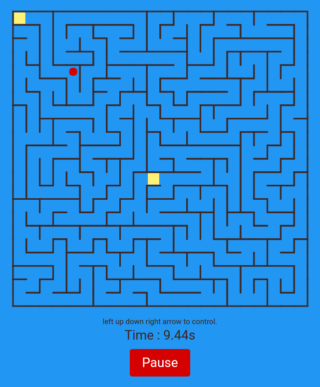

# Unpredictable



A maze game which randomize every about 15 seconds that make a lot of confusion to player.
[http://kosate.com/project/unpredictable](http://kosate.com/project/unpredictable)

## Work Process

I use `Paper.js` for my work. Combine with `gulp` for automatic compile `CoffeeScript`.

The maze generated by depth-first-search traversal to build a complicate puzzling map.

## Build Project

install [npm](npmjs.com) and build your directory to put project in it and run this command.
```
npm install
```
After that
```
npm install -g gulp
```
And then,
```
gulp build
```
Finish~

If you would like to build the project in realtime. You just run
```
gulp watch
```
